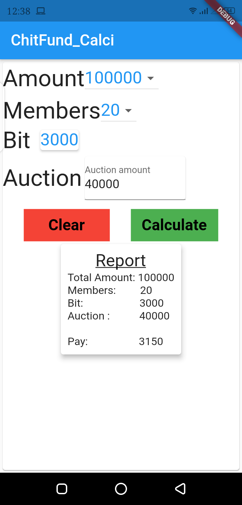

# ChitFund_Calci

A Calculator for Chit Funds Amount calculation

## Screenshot

This project used for calculating Chit payable amount based on attributes such as auction, total months, commision, total amount

Users can select the above attributes through dropdown menus but the auction amount should be given through text box

after giving all inputs, the calculate button should be pressed to get the final payable amount in the details report format

if you like the code and logic created for calculation Hit Like :thumbsup: 

Copyrights reserved @ Ramakrishna-ch 2021.
